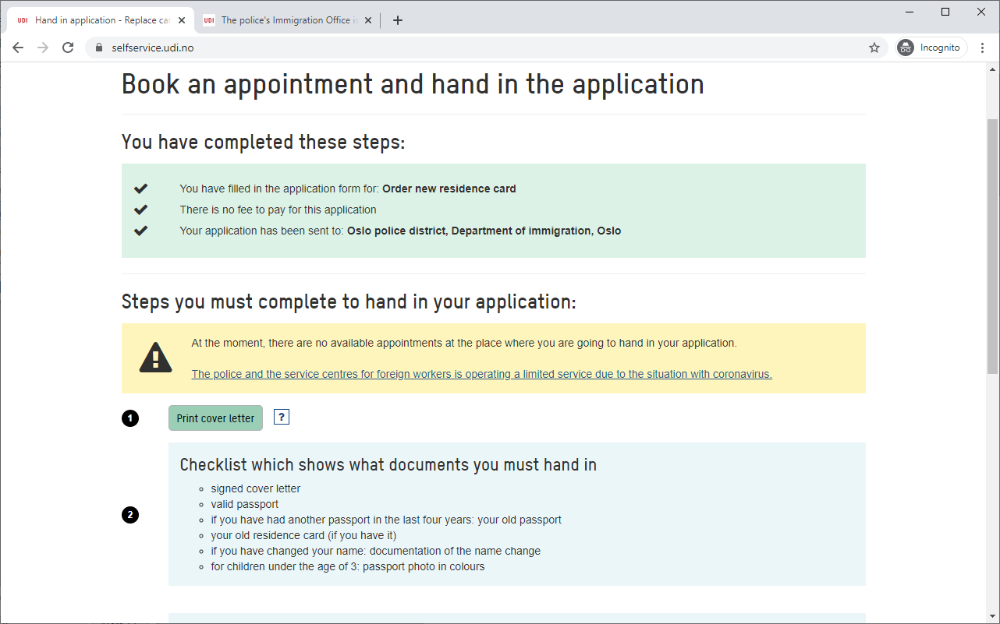

# Appointment availability checker for UDI, Norway

Norwegian Directorate of Immigration (UDI) is open with limited offers due to corona crisis.
Those living in Oslo area may be faced with a message that there are no available appointments:



Note that there is no "Notify me when there is one" button. Heh? We live in a 21st century and UDI's
suggests to "... you can log in regularly and check if there are available appointments for your application type."

This repo can be used to automate this task.

## What it does

This is a small script that logins to UDI with your personal credentials, opens the very first
application and checks if there is an error message presented on the page. If there is no error message,
then the script will send a message and page screenshot to a Telegram bot.

## Usage

1. Create python virtual environment.
2. Clone the code `git clone https://github.com/fralik/udiinformer.git`.
3. Go to the repo folder and run:
   ```
   pip install -r requirements.txt
   python -m playwright install
   telegram-send.exe --configure
   ```
4. Provide your credentials. You have several options (choose one):
    * Copy `.env.example` to `.env` and modify it.
    * Set environment variables `UDI_EMAIL`, `UDI_PWD`.
     * Modify `main.py` file and provide your credentials right in the source code.
  to write your credentials there.
5. `python main.py`.

 I advise to use this script from a cron job or scheduled task.
